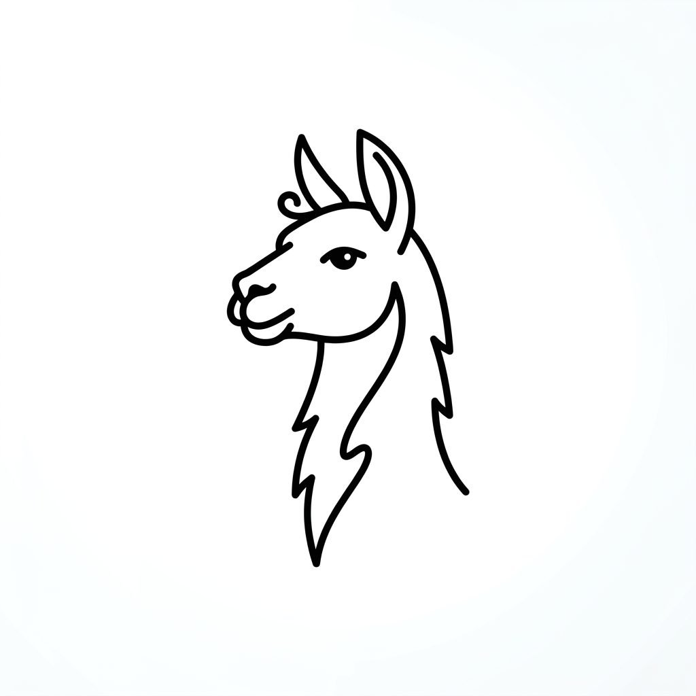
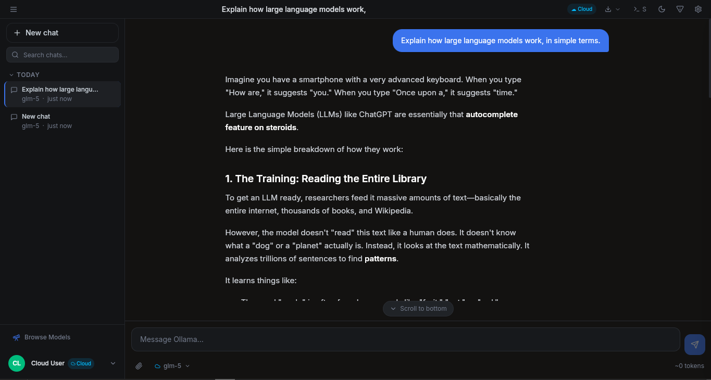

<div align="center">



# Ollama Chat

**A native Linux desktop UI for Ollama — ~3.5MB, no Docker, no Node.js, no nonsense.**

[](LICENSE)
[](https://tauri.app)
[](https://www.typescriptlang.org)
[](https://react.dev)
[](https://github.com/itslokeshx/ollama-chat/releases)
[](#-installation)

<br>

<div align="center">

## 🚀 **Get Started Now**

[](https://github.com/itslokeshx/ollama-chat/releases/download/v1.0.0/Ollama.Chat_1.0.0_amd64.deb)

<p align="center">
  <strong>v1.0.0</strong> • <strong>~3.5MB</strong> • <strong>Linux (amd64)</strong> • <strong>Free & Open Source</strong>
</p>

</div>

<br>



</div>

---

## 📋 Table of Contents

- [🤔 Why I built this](#-why-i-built-this)
- [⬇ Installation](#-installation)
- [🎯 Getting Started](#-getting-started-3-minutes)
- [✨ Features](#-features)
- [🖼 Screenshots](#-screenshots)
- [🛠 Tech Stack](#-tech-stack)
- [🏗 Build from Source](#-build-from-source)
- [🤝 Contributing](#-contributing)
- [📄 License](#-license)

---

## 🤔 Why I built this

If you use Ollama on Linux, you already know the pain.

You install Ollama, pull a model, and then... **you're stuck in a terminal forever**. Want to switch models? Type a command. Want to use a different model mid-chat? Stop, remember the command, switch, start again. Want to upload an image? Hope you know the exact syntax. Want a chat interface like Claude or ChatGPT? **Linux users are left behind** — Ollama has a beautiful native UI for macOS, but Linux gets nothing.

Here's what your "UI options" look like on Linux:

| Tool                   | Size      | What You Need                           | Reality                                    |
| ---------------------- | --------- | --------------------------------------- | ------------------------------------------ |
| **Open WebUI**         | 500MB+    | Docker daemon + container runtime       | Heavy, always-on background process        |
| **Hollama, Lobe Chat** | 100MB+    | Node.js + npm install + terminal server | Not a real app — it's a web server you run |
| **Msty, Jan**          | 200–400MB | Electron runtime baked in               | Overkill for just talking to a local model |
| **Docker-based UIs**   | 1GB+      | Full Docker + images + volumes          | You're now managing containers             |
| **Browser extensions** | N/A       | Browser-dependent                       | Limited, can't do file uploads properly    |
| **Just use CLI**       | 0MB       | Memorize every command                  | Writing JSON by hand just to send an image |

**None of these feel like software. They feel like workarounds.**

### The Core Problem

Ollama for Linux is **headless by design** — great for servers, terrible for desktops. Every "UI solution" piles on more dependencies:

- Docker containers eating RAM
- Node.js servers you have to start/stop
- Browser tabs pretending to be apps
- 300MB+ Electron monsters

### The Solution

So I built **Ollama Chat** — a **proper native Linux desktop app** that actually respects your system:

| Feature          | Ollama Chat                       |
| ---------------- | --------------------------------- |
| **Size**         | **~3.5MB** (yes, really)          |
| **Install**      | Double-click `.deb`, done         |
| **Dependencies** | Just Ollama — nothing else        |
| **Runtime**      | Native binary, no Docker, no Node |
| **Memory**       | Uses ~50MB RAM                    |
| **Speed**        | Native window, instant launch     |

- Shows up in your **application menu**
- **One click** to launch
- **Native minimize/maximize/close** buttons
- **Model switching** via dropdown, not commands
- **File uploads** via drag & drop
- Works **offline** with local models

This is what Ollama for Linux should have been from day one.

---

## ⬇ Installation

<div align="center">

[](https://github.com/itslokeshx/ollama-chat/releases/download/v1.0.0/Ollama.Chat_1.0.0_amd64.deb)

</div>

```bash
sudo dpkg -i Ollama.Chat_1.0.0_amd64.deb
```

> **⚠️ Prerequisite:** [Ollama](https://ollama.com) must be installed and running (`ollama serve`).

---

## 🎯 Getting Started (3 minutes)

### 1. Install Ollama

```bash
curl -fsSL https://ollama.com/install.sh | sh
```

### 2. Pull a Model

```bash
# Fast & smart (2GB) - great for general use
ollama pull llama3.2

# Vision-capable model (4GB) - for image chat
ollama pull llava

# Large model (8GB) - for complex tasks
ollama pull llama3.1:8b
```

### 3. Launch Ollama Chat

```bash
# Start Ollama in background
ollama serve &

# Launch the app
ollama-chat
```

That's it! You're ready to chat with your local AI models.

---

## ✨ Features

### 💬 Chat

- Real-time streaming responses — token by token, just like Claude or ChatGPT
- Full markdown rendering — code blocks, tables, bold, italics, all of it
- Syntax highlighting for 100+ languages
- Edit sent messages and regenerate responses
- Copy any message or code block with one click
- Multiple conversations with full history, saved locally

### 🤖 Models

- See all your installed models at a glance
- Smart model selector with **tier grouping** — Frontier (70B+), Balanced (7–34B), Efficient (<7B)
- Capability badges — `vision` `tools` `thinking` `cloud` per model
- Pull new models from inside the app with a live progress bar
- Delete models you no longer need
- Full model info panel — parameters, context length, quantization, size
- **Cloud model support** — use Ollama's hosted models when signed in

### 📎 Files & Images

- Attach images — works with any vision-capable model (LLaVA, Qwen2-VL, LLaMA3.2-Vision, etc.)
- Attach text files, code, PDFs — content injected cleanly into context
- Drag and drop files anywhere on the window
- Paste images directly from clipboard
- Full-screen lightbox for image previews

### ⚙️ Settings & Customization

- System prompt presets — Engineer, Writer, Analyst, Terminal, Concise
- Fine-tune temperature, top_p, top_k, max tokens, keep_alive
- Light / Dark / System theme
- Adjustable font size
- Ollama host URL configurable — works with remote Ollama instances too
- Export conversations as Markdown or JSON

### 🖥️ Native Desktop

- Installs as a real `.deb` package — shows up in your app menu
- Custom titlebar with native window controls
- Under 5MB installed
- No Docker, no Node.js, no background server processes
- Works offline (for local models)

---

## 🖼 Screenshots


---

## 🛠 Tech stack

| Layer           | Technology                     | Why                                         |
| --------------- | ------------------------------ | ------------------------------------------- |
| Desktop runtime | [Tauri 2.0](https://tauri.app) | Rust-based, tiny binary, real native window |
| Frontend        | React 18 + TypeScript          | Type-safe, component-driven UI              |
| Styling         | Tailwind CSS v4 + Radix UI     | Accessible, themeable, fast                 |
| State           | Zustand                        | Simple, no boilerplate                      |
| Build           | Vite 5                         | Fast dev, optimized production output       |
| Packaging       | `.deb` + `.AppImage`           | Native Linux install                        |

Tauri is the key ingredient here. Unlike Electron which bundles a full Chromium + Node.js runtime (hence 150–300MB apps), Tauri uses the system's existing WebKit renderer and a Rust backend. The result is a real native app that's a fraction of the size.

---

## 🏗 Build from Source

### Prerequisites

- **Node.js 18+** and **npm**
- **Rust toolchain** (latest stable)
- **Linux development libraries** (webkit2gtk, etc.)

### Quick Setup

```bash
# Install Rust (if not already installed)
curl --proto '=https' --tlsv1.2 -sSf https://sh.rustup.rs | sh
source ~/.cargo/env

# Clone and setup
git clone https://github.com/itslokeshx/ollama-chat
cd ollama-chat

# Install dependencies
npm install

# Development mode (opens native window with hot reload)
npm run tauri dev

# Production build
npm run tauri build

# Install the built package
sudo dpkg -i src-tauri/target/release/bundle/deb/Ollama.Chat_1.0.0_amd64.deb
```

---

## 🤝 Contributing

We welcome contributions! Here's how you can help:

### Ways to Contribute

- 🐛 **Bug Reports** — Found an issue? [Open an issue](https://github.com/itslokeshx/ollama-chat/issues)
- 💡 **Feature Requests** — Have an idea? [Start a discussion](https://github.com/itslokeshx/ollama-chat/discussions)
- 🛠️ **Code Contributions** — Fix bugs or add features via pull requests
- 📖 **Documentation** — Improve docs, tutorials, or examples
- 🧪 **Testing** — Test on different Linux distributions

### Development Workflow

1. Fork the repository
2. Create a feature branch (`git checkout -b feature/amazing-feature`)
3. Make your changes
4. Test thoroughly (`npm run tauri dev`)
5. Submit a pull request

### Guidelines

- Follow the existing code style
- Add tests for new features
- Update documentation as needed
- Ensure builds pass on all platforms

---

## 📄 License

**MIT License** — Free to use, modify, and distribute.

```
MIT License

Copyright (c) 2024 itslokeshx

Permission is hereby granted, free of charge, to any person obtaining a copy
of this software and associated documentation files (the "Software"), to deal
in the Software without restriction, including without limitation the rights
to use, copy, modify, merge, publish, distribute, sublicense, and/or sell
copies of the Software, and to permit persons to whom the Software is
furnished to do so, subject to the following conditions:

The above copyright notice and this permission notice shall be included in all
copies or substantial portions of the Software.

THE SOFTWARE IS PROVIDED "AS IS", WITHOUT WARRANTY OF ANY KIND, EXPRESS OR
IMPLIED, INCLUDING BUT NOT LIMITED TO THE WARRANTIES OF MERCHANTABILITY,
FITNESS FOR A PARTICULAR PURPOSE AND NONINFRINGEMENT. IN NO EVENT SHALL THE
AUTHORS OR COPYRIGHT HOLDERS BE LIABLE FOR ANY CLAIM, DAMAGES OR OTHER
LIABILITY, WHETHER IN AN ACTION OF CONTRACT, TORT OR OTHERWISE, ARISING FROM,
OUT OF OR IN CONNECTION WITH THE SOFTWARE OR THE USE OR OTHER DEALINGS IN THE
SOFTWARE.
```

---

<div align="center">

## 🚀 Ready to Chat?

<div align="center">

[](https://github.com/itslokeshx/ollama-chat/releases/download/v1.0.0/Ollama.Chat_1.0.0_amd64.deb)

**Built for Linux users who just want a proper UI for their local AI.**

</div>

<br>

<div align="center">

**Made with ❤️ by [itslokeshx](https://github.com/itslokeshx)**

[⭐ Star this repo](https://github.com/itslokeshx/ollama-chat) • [🐛 Report issues](https://github.com/itslokeshx/ollama-chat/issues) • [💬 Discussions](https://github.com/itslokeshx/ollama-chat/discussions)

</div>

</div>
